# events_infrastructure
En este repositorio se almacena todo lo relacionado a diagramas e infraestructura del proyecto Nebula Eventual


# Nebula-Eventual — Sistema de gestión y venta de boletas

> Plataforma distribuida para la venta, gestión y validación de boletas para eventos. Construida con una arquitectura de microservicios usando Laravel, ASP.NET Core, React, MySQL y MongoDB.

---

## Tabla de contenidos

- [Visión general](#visión-general)
- [Arquitectura](#arquitectura)
- [Aplicaciones](#aplicaciones)
  - [Frontends](#frontends)
  - [Backends](#backends)
- [Bases de datos](#bases-de-datos)
- [Servicios de soporte](#servicios-de-soporte)
- [Comunicación entre servicios](#comunicación-entre-servicios)
- [Flujo típico de una compra](#flujo-típico-de-una-compra)
- [Flujo de validación en puerta](#flujo-de-validación-en-puerta)
- [Tecnologías utilizadas](#tecnologías-utilizadas)
- [Repositorios](#repositorios)
- [Equipo](#equipo)

---

## Visión general

Nebula es una plataforma web distribuida que permite a los usuarios comprar boletas para eventos de forma online, a los empleados venderlas de forma presencial e imprimirlas físicamente, y a los validadores confirmar el ingreso al evento escaneando códigos QR virtuales o físicos.

El sistema está compuesto por cuatro aplicaciones frontend independientes, tres servicios backend con responsabilidades separadas, dos bases de datos relacionales, una base de datos no relacional para logs, y servicios externos para pagos, almacenamiento de imágenes y notificaciones por correo.

---

## Arquitectura

El sistema sigue una arquitectura de **microservicios con múltiples frontends**. Cada frontend consume únicamente las APIs que corresponden a su dominio funcional. La autenticación es transversal: un único Auth Service emite tokens JWT que los demás servicios validan de forma independiente usando una clave secreta compartida.



## Aplicaciones

### Frontends

Cada frontend es una aplicación React independiente desplegada en su propio subdominio. Todas se comunican con los backends exclusivamente a través de peticiones HTTP con el token JWT en el header `Authorization: Bearer`.

#### `nebula.andrescortes.dev` — Portal de usuarios

Interfaz pública para usuarios finales. Permite el registro, inicio de sesión, exploración de eventos disponibles, compra de boletas y visualización del historial de compras con sus códigos QR.

| Funcionalidad | Backend que consume |
|---|---|
| Registro e inicio de sesión | Auth Service |
| Listado y detalle de eventos | Eventos Service |
| Compra de boletas y pago | Eventos Service + Stripe |
| Ver mis boletas con QR | Eventos Service |

#### `admin.nebula.andrescortes.dev` — Panel de administración

Interfaz exclusiva para administradores. Permite la gestión completa de eventos y empleados, y la visualización de métricas de ventas. Los administradores son creados directamente en base de datos o por un superadmin; no tienen acceso a las vistas de clientes ni empleados.

| Funcionalidad | Backend que consume |
|---|---|
| Inicio de sesión | Auth Service |
| CRUD de eventos con categorías y aforo | Eventos Service |
| Creación y gestión de empleados | Auth Service |
| Métricas de ventas por evento y período | Eventos Service |

#### `tickets.nebula.andrescortes.dev` — Punto de venta presencial

Interfaz para empleados vendedores. Permite identificar a un cliente por correo electrónico o cédula, venderle boletas presencialmente e imprimir el boleto físico en una impresora local. Si el cliente no tiene cuenta, la boleta se envía únicamente al correo proporcionado.

| Funcionalidad | Backend que consume |
|---|---|
| Inicio de sesión | Auth Service |
| Búsqueda de cliente por correo o cédula | Auth Service + Eventos Service |
| Venta presencial e impresión física | Eventos Service |

#### `access.nebula.andrescortes.dev` — Validación en puerta

Interfaz para empleados validadores. Permite escanear códigos QR virtuales o físicos, verificar si el ticket es válido o ya fue usado, y marcar el ingreso automáticamente.

| Funcionalidad | Backend que consume |
|---|---|
| Inicio de sesión | Auth Service |
| Escaneo y validación de QR | Validación Service |
| Conteo de ingresos en tiempo real | Validación Service |

---

### Backends

#### Auth Service — `Laravel 11 + Passport`

Servicio transversal de autenticación e identidad. Es el único servicio que emite tokens JWT y el único que tiene acceso a la base de datos de usuarios. Los demás servicios validan los tokens de forma local usando la clave secreta compartida, sin consultar al Auth Service en cada petición.

**Responsabilidades:**
- Registro de usuarios y creación de empleados por parte del admin
- Autenticación con email y contraseña
- Emisión de JWT con payload: `{ sub, email, rol, exp }`
- Invalidación de tokens en logout
- Recuperación de contraseña por correo
- Activación y desactivación de cuentas de empleados

**Roles manejados:** `cliente`, `empleado_ventas`, `empleado_validador`, `admin`

#### Eventos Service — `ASP.NET Core 8`

Núcleo del negocio. Gestiona la información de eventos, el proceso de compra, la generación de códigos QR y la integración con Stripe. Los permisos dentro del servicio se determinan por el rol incluido en el JWT: un admin puede crear y editar eventos, un cliente solo puede leer y comprar.

**Responsabilidades:**
- CRUD de eventos con categorías de boleta (VIP, palco, general, etc.), aforo máximo y precios por categoría
- Subida de imágenes de portada a AWS S3
- Compra de boletas con verificación de aforo disponible
- Integración con Stripe para procesamiento de pagos
- Generación de código QR único por boleta usando `QRCoder`
- Venta presencial por parte de empleados
- Métricas de ventas: por evento, por período, por categoría

#### Validación Service — `ASP.NET Core 8`

Servicio liviano encargado del control de acceso en la puerta del evento. Lee y escribe sobre la BD Negocio compartida con Eventos Service. Su única responsabilidad es verificar si un ticket es válido y marcarlo como usado.

**Responsabilidades:**
- Recepción del UUID extraído del QR escaneado
- Verificación de existencia, estado y correspondencia con el evento activo
- Marcado del ticket como usado al primer escaneo exitoso
- Respuesta inmediata: `VÁLIDO`, `YA USADO` o `INVÁLIDO`
- Conteo de ingresos validados en tiempo real

---

## Bases de datos

### BD Auth — `MySQL 8`

Propiedad exclusiva del Auth Service. Ningún otro servicio tiene acceso directo a esta base de datos.

| Tabla | Descripción |
|---|---|
| `users` | Usuarios del sistema con email, contraseña hasheada, cédula y estado |
| `roles` | Roles disponibles: cliente, empleado_ventas, empleado_validador, admin |
| `user_roles` | Relación muchos a muchos entre usuarios y roles |
| `personal_access_tokens` | Tokens JWT emitidos por Passport |
| `password_reset_tokens` | Tokens temporales para recuperación de contraseña |

### BD Negocio — `MySQL 8`

Compartida entre Eventos Service y Validación Service. Cada servicio accede únicamente a las entidades de su responsabilidad.

| Tabla | Descripción |
|---|---|
| `eventos` | Información del evento: nombre, descripción, fecha, imagen, estado |
| `categorias_boleta` | Tipos de boleta por evento (VIP, palco, general) con precio y aforo |
| `boletas` | Boletas emitidas con UUID, QR, comprador, categoría y estado |
| `compras` | Registro de transacciones con referencia a Stripe |
| `empleados` | Referencia al user_id de Auth con rol y datos laborales |

### MongoDB Atlas — `Logs del sistema`

Base de datos no relacional para registro de eventos del sistema. Cada servicio escribe en su propia colección dentro de una única base de datos `nebula_logs`.

| Colección | Descripción |
|---|---|
| `logs_auth` | Intentos de login, registros, cambios de contraseña |
| `logs_eventos` | Compras, cancelaciones, modificaciones de eventos |
| `logs_validacion` | Escaneos realizados, accesos concedidos y rechazados |

---

## Servicios de soporte

### n8n — Orquestación de notificaciones

Herramienta de automatización de flujos que desacopla las notificaciones del código de negocio. Los backends publican eventos (por ejemplo `ticket_comprado`) y n8n los recoge, arma las plantillas de correo y los envía a través del proveedor configurado.

| Flujo | Disparador |
|---|---|
| Correo de bienvenida al nuevo usuario | `usuario_registrado` |
| Correo con QR tras compra online | `ticket_comprado` |
| Correo con QR en venta presencial sin cuenta | `ticket_vendido_presencial` |
| Notificación masiva al cancelar evento | `evento_cancelado` |

### Stripe — Pasarela de pagos

Integrado en Eventos Service para el procesamiento de pagos en línea. El proyecto opera en modo test durante el desarrollo, lo que permite simular transacciones completas sin dinero real.

### AWS S3 — Almacenamiento de imágenes

Bucket S3 para el almacenamiento de imágenes de portada de eventos. Los backends almacenan únicamente la URL pública del archivo en la base de datos; los frontends consumen las imágenes directamente desde S3 sin pasar por la API.

---

## Comunicación entre servicios

| Tipo | Descripción |
|---|---|
| HTTP REST | Toda comunicación entre frontends y backends |
| JWT compartido | Auth Service emite el token; los demás servicios lo validan localmente con la misma clave secreta |
| Evento asíncrono | Backends publican eventos hacia n8n para el envío de correos |
| BD compartida | Eventos Service y Validación Service comparten la BD Negocio |

La clave secreta del JWT se configura como variable de entorno en cada servicio y nunca se incluye en el código fuente.

```
# En Auth Service (.env de Laravel)
JWT_SECRET=clave_secreta_compartida

# En Eventos Service (appsettings.json de ASP.NET)
"Jwt": {
  "Key": "clave_secreta_compartida",
  "Issuer": "auth.nebula.andrescortes.dev"
}
```

---

## Flujo típico de una compra

```
1. Usuario hace login en nebula.
        ↓
2. Auth Service valida credenciales y emite JWT
   { sub: "uuid", email: "...", rol: "cliente" }
        ↓
3. nebula. muestra listado de eventos
   (petición a Eventos Service con JWT en header)
        ↓
4. Usuario selecciona evento y categoría de boleta
        ↓
5. Eventos Service verifica aforo disponible
        ↓
6. Usuario completa el pago a través de Stripe
        ↓
7. Eventos Service genera UUID único y código QR
        ↓
8. Eventos Service publica evento: ticket_comprado
        ↓
9. n8n recoge el evento y envía correo con QR adjunto
        ↓
10. QR queda también disponible en el perfil del usuario
```

---

## Flujo de validación en puerta

```
1. Empleado inicia sesión en access.
   (JWT con rol: empleado_validador)
        ↓
2. Empleado escanea QR con lector o cámara
        ↓
3. access. extrae el UUID del QR y lo envía a Validación Service
        ↓
4. Validación Service consulta la BD Negocio:
   ¿Existe el ticket? ¿Está activo? ¿Corresponde a este evento?
        ↓
5a. VÁLIDO   → marca ticket como usado, muestra pantalla verde
5b. YA USADO → rechaza ingreso, muestra pantalla roja
5c. INVÁLIDO → rechaza ingreso, muestra pantalla roja
```

---

## Tecnologías utilizadas

| Capa | Tecnología | Versión |
|---|---|---|
| Frontend | React | 18 |
| Auth Service | Laravel + Passport | 11 |
| Eventos Service | ASP.NET Core | 8 |
| Validación Service | ASP.NET Core | 8 |
| BD Auth | MySQL | 8 |
| BD Negocio | MySQL | 8 |
| Logs | MongoDB Atlas | — |
| Imágenes | AWS S3 | — |
| Pagos | Stripe | — |
| Notificaciones | n8n | — |
| Generación QR | QRCoder (NuGet) | — |

---

## Repositorios

Este repositorio (`events_infrastructure`) contiene la documentación general de arquitectura del sistema. Cada servicio y frontend tiene su propio repositorio dentro de la organización.

| Repositorio | Descripción |
|---|---|
| `events_infrastructure` | Documentación de arquitectura (este repositorio) |
| `events_auth` | Auth Service — Laravel 11 |
| `events_api` | Eventos Service — ASP.NET Core 8 |
| `events_validation` | Validación Service — ASP.NET Core 8 |
| `events_landing` | Frontend nebula. — React |
| `events_admin` | Frontend admin. — React |
| `events_tickets` | Frontend tickets. — React |
| `events_access` | Frontend access. — React |

---

## Equipo

| Persona | Responsabilidad |
|---|---|
| Dev1 | Auth Service (Laravel) + Frontend login/registro |
| Dev2 | Eventos Service (ASP.NET) + Frontend nebula. |
| Dev3 | Eventos Service (ASP.NET) + Frontend admin. |
| Dev4 | Eventos Service (ASP.NET) + Frontend tickets. |
| Dev5 | Validación Service (ASP.NET) + Frontend access. |

---

*Proyecto académico — RIWI Cohorte 6 · 2025*